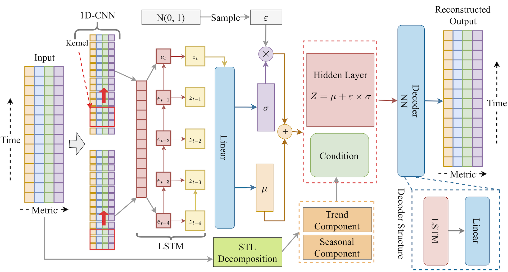

# AnoTuner

## Overview

As cellular networks have continued to evolve rapidly, Wireless Base Stations (WBSes) play an indispensable role in ensuring the smooth operation of these networks. Service providers persistently monitor the functional status of these WBSes and employ anomaly detection techniques to quickly spot any irregularities. However, the conventional anomaly detection methods often fail to capitalize on periodic feedback, which can be instrumental in enhancing their detection performance.

In particular, in real-world scenarios, the feedback often has a low frequency of false negatives, and its data distribution may be notably different from the original training dataset. This difference can lead to limited performance improvements in existing methods.

## Introducing AnoTuner

In light of these challenges, this project presents **AnoTuner (Feedback-based Enhancement in Anomaly Detection)**. AnoTuner brings forth two primary mechanisms to address these shortcomings:

1. **False Negative Augmentation Mechanism**: This mechanism is designed to generate feedback cases that mirror false negatives. This assists in offsetting the typically low frequency of such feedback, ensuring the method remains robust and efficient.

2. **Two-Stage Active Learning (TSAL)**: TSAL aims to address potential data contamination challenges that may arise from the discrepancy between feedback and training data distributions. It optimizes the learning process to better handle the feedback data and ensures a higher quality of anomaly detection.

## Experimental Results

AnoTuner's efficacy has been put to the test using real-world data sourced from a leading global Internet Service Provider (ISP). The results indicate that AnoTuner, after undergoing feedback-based fine-tuning, exhibits a significantly better performance improvement as compared to other baseline methods.

---

This project seeks to push the boundaries of anomaly detection in the realm of cellular networks and contribute to a more resilient and efficient cellular infrastructure. We welcome collaboration and feedback from the community.

## Overview

